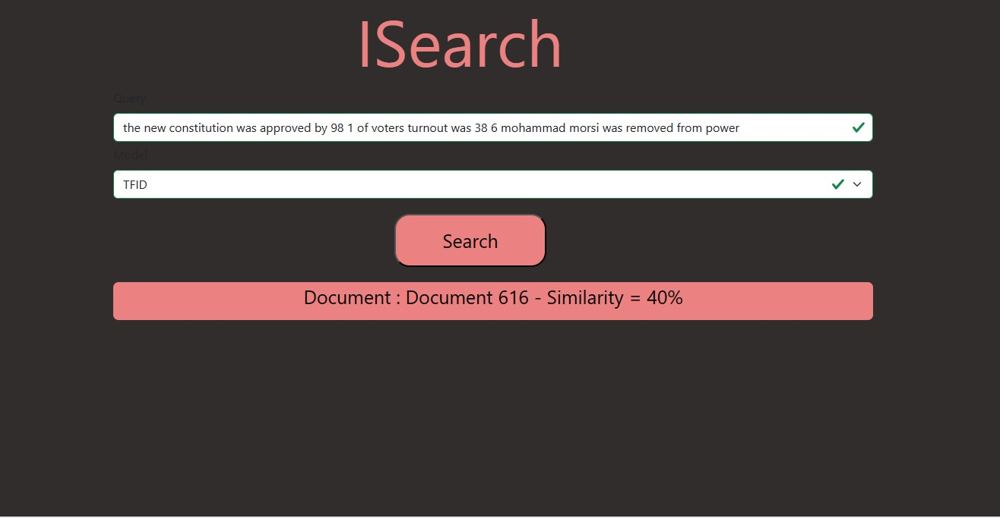
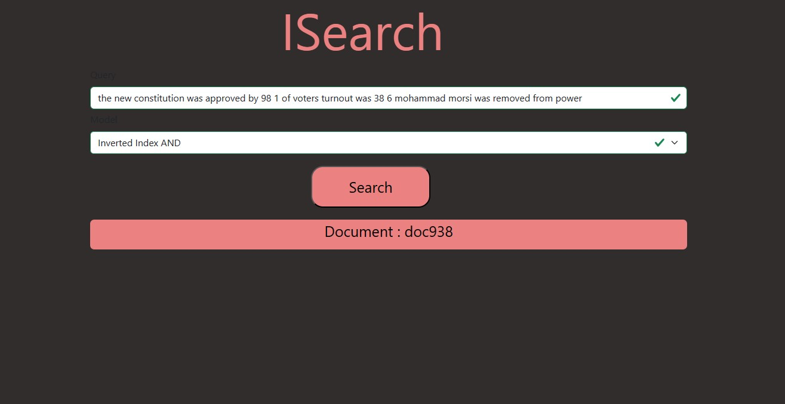
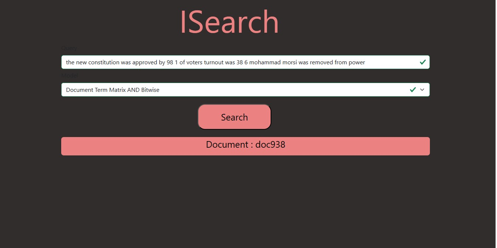
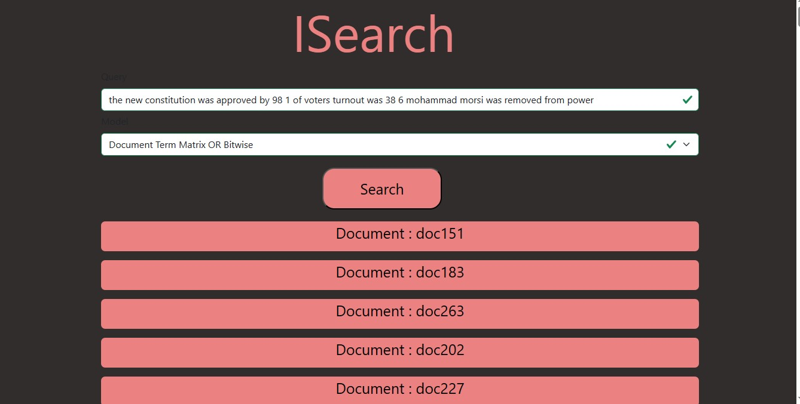
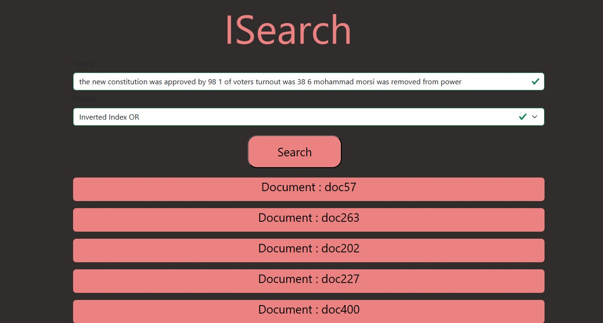

# ISearch
 - it is search engine That use any NLP techniques to get that documents that most 
   relevant to user 's query .

## Details
 - Using basic NLP techniques such as term document materix , inverted    
   index and tfidf to build search engine . use cosine similarity to give score for each documents to retrive document that most relevant to user 's query .

## Dataset
 - the dataset that is used , it is wikIR1k that contains on documents.csv file that include the  id of documents and the documents itself .
- there is 23898 documents
  <h4>Link: https://ir-datasets.com/wikir.html#wikir/en1k/training</h4>

## Techniques
 - Text Preprocessing
 - TFIDF
 - Term Document Materix
 - Inverted Index
 - Cosine similarity

 ## Framework
 - Django

## Usage
  git clone https://github.com/Shymaa2611/ISearch.git
   
  cd ISearch
   
  pip install -r requirements.txt
   
  python manage.py runserver
